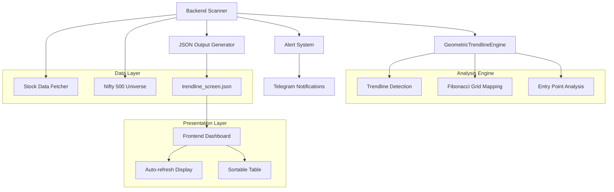

# Design Document

## Overview

The Macro Monthly Trendline Entry Scanner is a sophisticated stock screening system that identifies high-probability entry opportunities by detecting when stock prices approach long-term monthly trendline support levels within institutional buying zones (Fibonacci retracement levels). The system leverages geometric trendline analysis, Fibonacci grid mapping, and real-time data processing to provide traders with actionable entry signals through an auto-refreshing HTML dashboard with optional Telegram alerts.

The design builds upon the existing `MacroInstitutionalEngine` class while introducing a new `GeometricTrendlineEngine` interface to meet the specific requirements for trendline detection and pattern analysis. The system processes all Nifty 500 stocks, applies sophisticated filtering criteria, and presents results in a user-friendly dashboard format.

## Architecture

The system follows a modular architecture with clear separation between data processing, analysis, and presentation layers:



### Key Architectural Principles

1. **Modular Design**: Clear separation between trendline analysis, data processing, and presentation
2. **Extensibility**: Easy to add new analysis patterns or modify existing algorithms
3. **Performance**: Efficient processing of 500+ stocks within 15-minute execution window
4. **Reliability**: Graceful error handling and data quality validation
5. **Real-time Updates**: Auto-refreshing dashboard with 5-minute intervals

## Components and Interfaces

### GeometricTrendlineEngine

The core analysis engine responsible for trendline detection and pattern analysis. This component will be implemented as an adapter/wrapper around the existing `MacroInstitutionalEngine` to provide the interface specified in the requirements.

```python
class GeometricTrendlineEngine:
    def __init__(self, buffer_percentage: float = 10.0, critical_trigger_percentage: float = 1.0):
        """
        Initialize the geometric trendline analysis engine.
        
        Args:
            buffer_percentage: Maximum distance from trendline for WATCHLIST status (default: 10%)
            critical_trigger_percentage: Maximum distance for CRITICAL_TOUCH status (default: 1%)
        """
        
    def extract_pattern_metrics(self, ticker: str) -> Optional[Dict]:
        """
        Extract trendline pattern metrics for a given stock ticker.
        
        Args:
            ticker: Stock symbol (e.g., "RELIANCE.NS")
            
        Returns:
            Dictionary containing pattern analysis or None if no valid pattern found
        """
```

### Backend Scanner

The main orchestration component that processes the Nifty 500 universe and generates screening results.

```python
class TrendlineScanner:
    def __init__(self):
        """Initialize scanner with GeometricTrendlineEngine and configuration."""
        
    def scan_nifty_500(self) -> List[Dict]:
        """
        Scan all Nifty 500 stocks for trendline opportunities.
        
        Returns:
            List of stock analysis results meeting screening criteria
        """
        
    def generate_json_output(self, results: List[Dict]) -> None:
        """
        Generate trendline_screen.json file with formatted results.
        
        Args:
            results: List of stock analysis results
        """
```

### Data Models

#### Stock Analysis Result

```python
@dataclass
class StockAnalysisResult:
    ticker: str
    current_price: float
    trigger_price: float
    distance_percentage: float
    target_exit: float
    stop_loss: float
    status: str  # "CRITICAL_TOUCH" or "WATCHLIST"
    fibonacci_level: Optional[str]
    pattern_zone: str
    position_size: int
    confluence_score: int
    trendline_strength: float
```

#### Fibonacci Grid

```python
@dataclass
class FibonacciGrid:
    base_price: float
    peak_price: float
    level_236: float
    level_382: float
    level_500: float
    level_618: float
    level_1000: float
    trigger_intersection: Optional[str]  # Which level intersects with trendline
```

#### Trendline Analysis

```python
@dataclass
class TrendlineAnalysis:
    start_date: datetime
    start_price: float
    end_date: datetime
    end_price: float
    current_trigger_price: float
    slope: float
    touch_count: int
    strength_score: float
    timeframe_months: float
```

### Frontend Dashboard Components

#### Data Loader

```javascript
class TrendlineDataLoader {
    constructor(jsonPath = 'trendline_screen.json') {
        this.jsonPath = jsonPath;
        this.refreshInterval = 300000; // 5 minutes
    }
    
    async loadData() {
        // Fetch and parse JSON data
    }
    
    startAutoRefresh() {
        // Set up automatic data refresh
    }
}
```

#### Table Renderer

```javascript
class TrendlineTableRenderer {
    constructor(tableBodyId) {
        this.tableBody = document.getElementById(tableBodyId);
    }
    
    renderStocks(stocks) {
        // Render stock data in sortable table format
    }
    
    formatCurrency(amount) {
        // Format prices in Indian Rupee format
    }
    
    createStatusBadge(status) {
        // Create animated status badges
    }
}
```

### Alert System Integration

The alert system integrates with existing Telegram infrastructure to send notifications for critical entry signals.

```python
class TrendlineAlertSystem:
    def __init__(self, telegram_bot_token: str, telegram_chat_id: str):
        """Initialize with Telegram credentials."""
        
    def send_critical_alert(self, stock_result: StockAnalysisResult) -> bool:
        """
        Send Telegram notification for critical trendline entry.
        
        Args:
            stock_result: Stock analysis result with CRITICAL_TOUCH status
            
        Returns:
            True if notification sent successfully, False otherwise
        """
```

## Data Models

### Core Data Structures

The system uses several key data structures to represent analysis results and intermediate calculations:

#### TrendlinePattern

Represents a detected trendline with all relevant geometric properties:

```python
class TrendlinePattern:
    start_point: TrendlinePoint
    end_point: TrendlinePoint
    slope: float
    intercept: float
    current_trigger_price: float
    touch_points: List[TrendlinePoint]
    strength_score: float
    timeframe_days: int
    
    def project_to_date(self, target_date: datetime) -> float:
        """Project trendline price to a specific date."""
        
    def calculate_distance_percentage(self, current_price: float) -> float:
        """Calculate percentage distance from current price to trendline."""
```

#### FibonacciAnalysis

Encapsulates Fibonacci retracement analysis results:

```python
class FibonacciAnalysis:
    touchback_base: float
    peak_price: float
    retracement_levels: Dict[str, float]  # "23.6%": price, "38.2%": price, etc.
    trigger_intersection: Optional[str]
    institutional_zone: bool
    
    def is_in_buying_zone(self, price: float) -> bool:
        """Check if price is within institutional buying zone (38.2% to 100%)."""
        
    def get_closest_level(self, price: float) -> Tuple[str, float]:
        """Find the closest Fibonacci level to given price."""
```

#### ScreeningResult

Complete analysis result for a single stock:

```python
class ScreeningResult:
    ticker: str
    timestamp: datetime
    current_price: float
    trendline_analysis: TrendlineAnalysis
    fibonacci_analysis: Optional[FibonacciAnalysis]
    entry_signal: EntrySignal
    risk_parameters: RiskParameters
    
    def to_json_dict(self) -> Dict:
        """Convert to JSON-serializable dictionary for frontend."""
```

### Database Schema (JSON Structure)

The system outputs results in a structured JSON format for frontend consumption:

```json
{
  "timestamp": "2024-01-15T10:30:00Z",
  "scan_summary": {
    "total_stocks_analyzed": 500,
    "stocks_meeting_criteria": 12,
    "critical_signals": 3,
    "watchlist_signals": 9
  },
  "results": [
    {
      "ticker": "RELIANCE",
      "currentPrice": 2456.75,
      "triggerPrice": 2445.20,
      "distanceRemaining": 0.47,
      "targetExit": 2934.24,
      "status": "CRITICAL_TOUCH",
      "fibLevelMatch": "61.8%",
      "patternZone": "Golden Ratio Floor",
      "positionSizing": {
        "allocatedAmount": 50000,
        "sharesToBuy": 20,
        "strictStopLoss": 2249.58,
        "pivotTargetExit": 2934.24
      },
      "confluenceScore": 9,
      "notificationTrigger": true,
      "trendlineDetails": {
        "slope": 7.43,
        "touchCount": 5,
        "strengthScore": 95.2,
        "timeframeMonths": 36.5
      }
    }
  ]
}
```

## Correctness Properties

*A property is a characteristic or behavior that should hold true across all valid executions of a system-essentially, a formal statement about what the system should do. Properties serve as the bridge between human-readable specifications and machine-verifiable correctness guarantees.*

After analyzing the acceptance criteria, I've identified several properties that can be validated through property-based testing. I've performed property reflection to eliminate redundancy and ensure each property provides unique validation value.

### Property 1: Trendline Detection Requires Minimum Data

*For any* stock analysis request, if the historical data contains fewer than 24 months of price data, the GeometricTrendlineEngine should return None and the stock should be excluded from results.

**Validates: Requirements 1.1, 9.1**

### Property 2: Trendline Validation Requires Minimum Touch Points

*For any* detected trendline, it should only be considered valid if it has at least 3 touch points within 2% tolerance of the trendline equation.

**Validates: Requirements 1.3**

### Property 3: Trigger Price Projection Accuracy

*For any* valid trendline with known slope and intercept, projecting to the current time period should produce a mathematically correct trigger price using linear equation y = mx + b.

**Validates: Requirements 1.4**

### Property 4: Fibonacci Level Calculation Accuracy

*For any* base price and peak price, the five Fibonacci retracement levels (23.6%, 38.2%, 50.0%, 61.8%, 100%) should be calculated as: peak - (range × fibonacci_percentage).

**Validates: Requirements 2.3**

### Property 5: Distance Percentage Calculation

*For any* current price and trigger price, the distance percentage should be calculated as: ((current_price - trigger_price) / trigger_price) × 100, rounded to 2 decimal places.

**Validates: Requirements 3.1, 4.5**

### Property 6: Status Assignment Based on Distance

*For any* stock with calculated distance percentage: if distance ≤ 1% then status = "CRITICAL_TOUCH", if 1% < distance ≤ 10% then status = "WATCHLIST", if distance > 10% then stock is excluded.

**Validates: Requirements 3.2, 3.3, 3.4**

### Property 7: Risk Parameter Calculations

*For any* trigger price, the stop loss should equal trigger_price × 0.92 (8% below) and target exit should equal trigger_price × 1.20 (20% above), both rounded to 2 decimal places.

**Validates: Requirements 4.2, 4.3**

### Property 8: Position Sizing Consistency

*For any* stock analysis result, the allocated amount should always be exactly ₹50,000 and shares to buy should be calculated as floor(50000 / trigger_price).

**Validates: Requirements 4.1**

### Property 9: JSON Output Structure Validation

*For any* generated JSON output, each stock object should contain exactly the required fields: ticker, currentPrice, triggerPrice, distance, targetExit, and status, with ticker symbols having ".NS" suffix removed.

**Validates: Requirements 5.3, 5.4**

### Property 10: Numerical Precision in Output

*For any* price values in the JSON output, they should be rounded to exactly 2 decimal places with no trailing zeros or precision errors.

**Validates: Requirements 5.5**

### Property 11: Result Sorting Consistency

*For any* list of screening results, when sorted by distance percentage in ascending order, each subsequent element should have distance_percentage ≥ previous element's distance_percentage.

**Validates: Requirements 5.6, 6.6**

### Property 12: Fibonacci Zone Filtering

*For any* stock where the trigger price falls outside all Fibonacci retracement zones (23.6% to 100%), the stock should be excluded from the final results.

**Validates: Requirements 2.5, 3.5**

### Property 13: Error Handling Continuity

*For any* stock that causes an exception during analysis, the scanner should continue processing the remaining stocks without terminating the entire scan process.

**Validates: Requirements 7.5, 8.4, 9.2, 9.3**

### Property 14: Alert Triggering Logic

*For any* stock with status "CRITICAL_TOUCH", the alert system should be triggered with a notification containing the ticker symbol and critical entry message.

**Validates: Requirements 8.1, 8.2**

### Property 15: Currency Formatting Consistency

*For any* price value displayed in the frontend, it should be formatted with the ₹ symbol prefix and exactly 2 decimal places.

### Property 15: Currency Formatting Consistency

*For any* price value displayed in the frontend, it should be formatted with the ₹ symbol prefix and exactly 2 decimal places.

**Validates: Requirements 6.3**

## Error Handling

The system implements comprehensive error handling to ensure reliability and graceful degradation when processing large datasets or encountering data quality issues.

### Data Quality Validation

1. **Insufficient Historical Data**: When a stock has less than 24 months of historical data, the system logs a warning and skips the stock without affecting other processing.

2. **Empty Data Responses**: When yfinance returns empty datasets, the system handles this gracefully by logging the issue and continuing with the next stock.

3. **Invalid Trendline Patterns**: When no valid ascending trendlines can be detected (insufficient touch points, negative slope, etc.), the system returns None and excludes the stock from results.

### Network and API Resilience

1. **Rate Limiting**: The system implements appropriate delays between API calls to respect yfinance rate limits and avoid being blocked.

2. **Retry Logic**: Failed data fetches are retried up to 3 times with exponential backoff before marking the stock as failed.

3. **Timeout Handling**: Long-running data fetches are subject to reasonable timeouts to prevent the system from hanging.

### Processing Continuity

1. **Exception Isolation**: Exceptions during individual stock analysis are caught and logged without terminating the entire scanning process.

2. **Partial Results**: The system can produce valid results even if some stocks fail analysis, ensuring maximum utility from available data.

3. **Progress Logging**: Detailed logging provides visibility into processing progress and helps identify problematic stocks.

### Alert System Resilience

1. **Non-blocking Alerts**: Alert failures do not interrupt the main scanning process - alerts are sent on a best-effort basis.

2. **Alert Logging**: Failed alert attempts are logged with sufficient detail for debugging and monitoring.

3. **Graceful Degradation**: The system continues to generate JSON output and dashboard updates even if the alert system is unavailable.

### Frontend Error Handling

1. **Data Loading Failures**: The dashboard displays appropriate error messages when the JSON file cannot be loaded.

2. **Malformed Data**: The frontend validates JSON structure and handles missing or invalid fields gracefully.

3. **Network Timeouts**: Auto-refresh functionality includes timeout handling and retry logic.

## Testing Strategy

The testing strategy employs a dual approach combining property-based testing for algorithmic correctness with integration testing for system behavior and user interface validation.

### Property-Based Testing

**Library Selection**: The system will use `hypothesis` for Python property-based testing, which provides excellent support for generating complex test data and shrinking failing examples.

**Test Configuration**: Each property test will run a minimum of 100 iterations to ensure comprehensive coverage of the input space. Tests will be tagged with comments referencing their corresponding design properties.

**Property Test Implementation**: Each correctness property will be implemented as a single property-based test with the following tag format:
```python
# Feature: trendline-scanner, Property 1: Trendline Detection Requires Minimum Data
@given(historical_data=stock_data_strategy(months=st.integers(0, 23)))
def test_minimum_data_requirement(historical_data):
    # Test implementation
```

**Key Property Test Areas**:
- Mathematical calculations (Fibonacci levels, distance percentages, risk parameters)
- Trendline detection algorithms (slope calculation, touch point validation)
- Data filtering and sorting logic
- JSON output structure and formatting
- Status assignment based on business rules

### Integration Testing

**System Integration**: Integration tests verify the complete workflow from data fetching through JSON generation to dashboard display.

**External Dependencies**: Tests for yfinance integration, file I/O operations, and Telegram alert functionality use mocked services to ensure reliability and speed.

**Frontend Integration**: Browser-based tests verify dashboard functionality, auto-refresh behavior, and error handling using tools like Selenium or Playwright.

### Unit Testing

**Component Testing**: Individual components (GeometricTrendlineEngine, TrendlineScanner, AlertSystem) are tested with specific examples and edge cases.

**Error Condition Testing**: Unit tests specifically target error conditions like network failures, malformed data, and edge cases in mathematical calculations.

**Mock-Based Testing**: External dependencies are mocked to test error handling paths and ensure proper exception propagation.

### Performance Testing

**Execution Time Validation**: Tests verify the system can process 500 stocks within the 15-minute requirement under normal conditions.

**Memory Usage Monitoring**: Tests ensure the system maintains reasonable memory usage when processing large datasets.

**Frontend Performance**: Tests verify dashboard loading and rendering performance with varying result set sizes.

### Test Data Management

**Synthetic Data Generation**: Property tests use generated data with known characteristics to verify algorithmic correctness.

**Historical Data Fixtures**: Integration tests use curated historical data samples that represent various market conditions and edge cases.

**Mock Data Services**: Tests use mock yfinance responses to simulate various data quality scenarios and network conditions.

### Continuous Integration

**Automated Test Execution**: All tests run automatically on code changes with clear pass/fail reporting.

**Property Test Seed Management**: Property test seeds are logged and can be replayed for debugging failing test cases.

**Performance Regression Detection**: CI pipeline includes performance benchmarks to detect regressions in execution time or resource usage.

The testing strategy ensures both correctness of individual algorithms and reliability of the complete system under various operating conditions, providing confidence in the system's ability to deliver accurate and timely trading signals.
